# RScout Technical Documentation

Essential technical information for developers and contributors.

## Architecture Overview

### System Architecture

```mermaid
graph TB
    CLI[CLI Interface<br/>main.rs] --> Engine[Discovery Engine<br/>engine.rs]
    
    Engine --> Hostname[Hostname Strategy<br/>detect/hostname.rs]
    Engine --> MAC[MAC Strategy<br/>detect/mac.rs]
    Engine --> OS[OS Strategy<br/>detect/os.rs]
    Engine --> Port[Port Strategy<br/>detect/port.rs]
    
    Hostname --> Network[Network Utilities<br/>net.rs]
    MAC --> DB[OUI Database<br/>db.rs]
    OS --> Network
    Port --> Network
    
    Engine --> Model[Data Models<br/>model.rs]
    Model --> Output[Table Formatter<br/>table.rs]
    
    classDef strategy fill:#e1f5fe
    classDef core fill:#f3e5f5
    classDef data fill:#e8f5e8
    
    class Hostname,MAC,OS,Port strategy
    class Engine,CLI,Network core
    class Model,DB,Output data
```


### Detection Strategy Flow


### Component Relationships


## Project Architecture

### Core Components
```
src/
├── main.rs                # CLI entry point
├── lib.rs                 # Library API
├── engine.rs              # Discovery orchestration
├── detect/                # Detection strategies
│   ├── hostname.rs        # Hostname resolution
│   ├── mac.rs             # MAC address analysis
│   ├── os.rs              # OS detection
│   └── port.rs            # Port scanning
├── model.rs               # Data structures
├── net.rs                 # Network utilities
└── config.rs              # Configuration
```

### Detection Strategy Pattern
Each detection module implements the `DeviceDetectionStrategy` trait:
- **EnhancedHostnameStrategy**: Resolves hostnames using multiple methods
- **EnhancedMacAddressStrategy**: Analyzes MAC addresses for vendor/type
- **AdvancedOSDetector**: Detects OS through service analysis
- **EnhancedPortScanStrategy**: Scans for open ports and services

### Data Flow
1. **Input**: Network range or interface name
2. **Ping Sweep**: Discover active devices
3. **Parallel Detection**: Run all strategies concurrently
4. **Result Aggregation**: Merge findings into device profiles
5. **Output**: Formatted table display

## Development Setup

### Prerequisites
- Rust 1.70+
- Cargo

### Building and Running
```bash
# Development build
cargo build

# Release build
cargo build --release

# Run directly
cargo run -- 192.168.1.0/24

# Install locally
cargo install --path .
```

### Useful Development Commands
```bash
# Format code
cargo fmt

# Lint code
cargo clippy

# Generate documentation
cargo doc --open

# Check for outdated dependencies
cargo outdated
```

## Key Data Structures

### NetworkDevice
```rust
pub struct NetworkDevice {
    pub ip: IpAddr,
    pub mac: Option<MacAddress>,
    pub hostname: Option<String>,
    pub device_type: DeviceType,
    pub operating_system: Option<OperatingSystem>,
    pub services: Vec<NetworkService>,
    pub vendor: Option<String>,
}
```

### DeviceType Enum
```rust
pub enum DeviceType {
    Computer, Smartphone, Tablet, Router, Switch,
    AccessPoint, Printer, SmartTV, IoTDevice,
    Server, AppleDevice, Unknown,
}
```

## Configuration

### ScanConfig
Main configuration structure with sensible defaults:
- `max_concurrent_jobs: 64`
- `ping_timeout: 1 second`
- `port_scan_timeout: 3 seconds`
- All detection strategies enabled by default

### Environment Variables
```bash
# Debug logging
RUST_LOG=debug

# Backtrace on errors
RUST_BACKTRACE=1
```

## Error Handling

### NetworkDiscoveryError
Comprehensive error type covering:
- Network errors
- DNS resolution failures
- Port scanning issues
- Configuration problems
- Strategy-specific errors

## Adding New Features

### New Detection Strategy
1. Implement `DeviceDetectionStrategy` trait
2. Add to `detect/mod.rs`
3. Create tests in `tests/`
4. Update documentation if needed

### New Device Type
1. Extend `DeviceType` enum in `model.rs`
2. Update classification logic in strategies
3. Add test cases

## Performance Notes

- Async-first design using Tokio runtime
- Configurable concurrency limits
- Connection reuse where possible
- OUI database caching for repeated lookups

## Security Considerations

- Requires appropriate network permissions
- Rate limiting to avoid network disruption
- Clear documentation of security implications
- Emphasis on responsible usage


## Running Tests

### Basic Test Commands
```bash
# Run all tests
cargo test

# Run specific test modules
cargo test --test hostname_tests    # Hostname detection (3 tests)
cargo test --test mac_tests         # MAC address analysis (5 tests)
cargo test --test os_tests          # OS detection (5 tests)
cargo test --test port_tests        # Port scanning (2 tests)
cargo test --test integration_tests # Integration tests (3 tests)
cargo test --test edge_case_tests   # Edge cases (3 tests)

# Run with verbose output
cargo test -- --nocapture

# Run specific test by name
cargo test test_hostname_resolution_arp
```

### Test Organization
```
tests/
├── test_utils.rs          # Shared utilities
├── hostname_tests.rs      # Hostname strategy tests
├── mac_tests.rs           # MAC address tests  
├── os_tests.rs            # OS detection tests
├── port_tests.rs          # Port scanning tests
├── integration_tests.rs   # Integration tests
└── edge_case_tests.rs     # Error handling tests
```